<h1>Memory game com assembly e instruções MIPS</h1>

André Lucas de Souza Lima  
Jonathas Levi Pascoal Palmeira 
Ciência da Computação - Universidade Federal do Cariri  
Desenvolvido na disciplina de Arquitetura e Organização de Computadores  
Instruído pelo docente Ramon Santos Nepomuceno
  

<h2>Do que se trata</h2>

Este projeto contém um jogo da memória em console criado a partir da IDE Mars, usada para a criação de programas em assembly, e um adicional da implementação prática de algumas instruções de processadores do tipo MIPS no software Logisim, plataforma utilizada para simular circuitos de baixo nível em um meio digital.

Abaixo, uma imagem do layout inicial do jogo da memória:

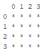

Também, uma figura do MIPS no Logisim:

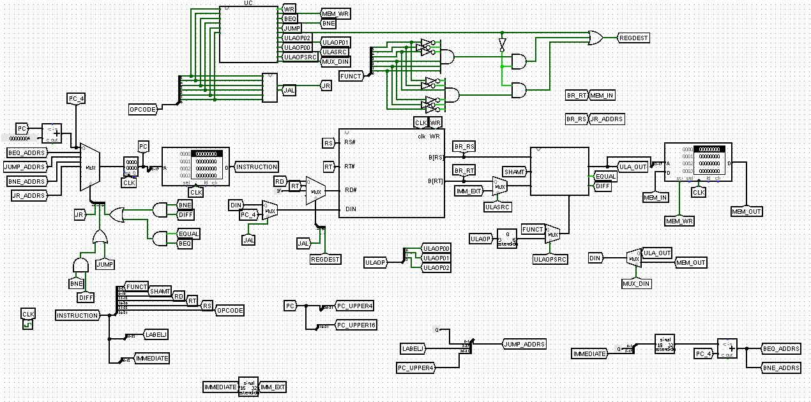

Nosso principal objetivo foi aprender técnicas e estruturas utilizadas em um âmbito de programação em assembly e nos familiarizar com a linguagem.

Além disso, também pudemos constatar o funcionamento das suas instruções ao construi-las passo a passo pela construção de um processador MIPS no Logisim;

<h2>Como instalar o Mars</h2>

O software Mars, ferramenta chave para a programação em assembly aplicada nesse projeto, pode ser encontrado por esse <a href= "https://computerscience.missouristate.edu/mars-mips-simulator.htm">link</a> que o direciona para o site da universidade de Missouri State.

Lá, o seguinto botão deve ser apertado:

Após ser levado ao repositório GitHub do Mars, siga pelo link abaixo de "Releases":

E então, acesse o componente mostrado aqui e siga os passos de instalação para ter acesso ao executável do Mars.

<h2>Como instalar o Logisim</h2>

A forma mais rápida e segura de instalar o Logisim é pelo site SourceForge, conhecido por disponibilizar downloads em uma plataforma sólida.

Ao acessar este <a href="https://sourceforge.net/projects/circuit/">link</a>, você deve ser redirecionado para a página do Logisim no SourceForge.

A partir disso, basta apenas apertar o botão principal escrito "Download" igual ao a seguir, que transferirá um executável para seu navegador e solicitará um local de armazenamento no computador.

Após isso, o Logisim já estará instalado e pronto para ser executado por meio desse arquivo.

<h2>Memory game</h2>

<h3>Como jogar</h3>

Assim como um jogo da memória real, esse consiste em tentar acertar todos os pares de números iguais do tabuleiro, sendo jogado em turnos, com um looping que reinicia a cada vez que a última jogada acontecer.

No primeiro turno, o tabuleiro é mostrado com todas as cartas ocultas e é escolhido um número a partir de um índice de linha e coluna selecionados pelo usuário. Após isso, tal elemento é revelado temporariamente com uma impressão adicional do tabuleiro.

Posteriormente, o jogador deve escolher seu segundo número pela decisão da linha e coluna desejadas. Então, ele também deixa de estar oculto para, mais uma vez, o tabuleiro ser impresso no console.

No último passo, o programa verifica se os números elencados pelo usuário são iguais. Caso sejam, são revelados até o fim do jogo; caso contrário, são escondidos novamente.

O looping do Memory Game continua até que todos os pares tenham sido revelados, que é quando a execução se encerra.

<h3>Funcionamento</h3>

A estruturação do programa parte da ideia de o dividir em blocos, sendo o primeiro o looping do jogo e os subsequentes funções que serão executadas em seu interior.

Primeiramente, ocorre-se a declaração das constantes e variáveis de endereço no início do programa:

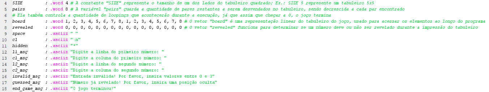

A primeira constante "SIZE" guarda o tamanho do tabuleiro de jogo (ou do lado do tabuleiro), sendo que a quantidade de elementos é sempre SIZE * SIZE. Ex.: Um tabuleiro de SIZE = 7 represnta um jogo com SIZE * SIZE = 7 * 7 = 49 números a serem descobertos.

A variável "pairs" representa a quantidade de pares que restam a serem palpitados durante as jogadas, de modo que "pairs" sempre deverá ser inicializada como (SIZE * SIZE) / 2. Ex.: Um tabuleiro de SIZE = 6 sempre precisará ter "pairs" declarado, no início da execução, como igual a (SIZE * SIZE) / 2 = (6 * 6) / 2 = 36 / 2 = 18.

O vetor "board" é responsável por ser a representação linear do tabuleiro do jogo para que possa ser manipulado como necessário ao longo do código.

Já o vetor "revealed" é uma forma de ministrar se cada elemento deve ou não ser revelado, tendo correspondência com o vetor "board" para que as mesmas posições em ambos vetores representem os mesmos elementos. Ex.: O quarto elemento do vetor "board" encontra sua correspondência, igualmente, no quarto elemento do vetor "revealed", onde é guardado o valor numérico que informa se ele deve ser impreso ou não. Esse número pode ser: 0 - oculto; 1 - acertado; 2 - revelado temporariamente.

As demais strings serão apenas usadas para imprimir certas informações e espaçamentos no console, a fim de tornar a experiência do usuário mais agradável.

Após isso, há a declaração inicial dos registradores não temporários que serão usados, são eles:

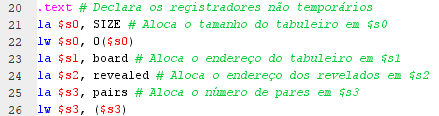

Como pode ser visto, o valor de "SIZE" está sendo guardado no registrador $s0 e veremos que será de grande importância. Também, $s1 e $s2 são declarados como, respectivamente, os endereços dos vetores "board" e "revealed". Por último, $s3 fica responsável por possuir o número que representa a quantidade de pares restantes.

Como mencionado anteriormente, o looping é:

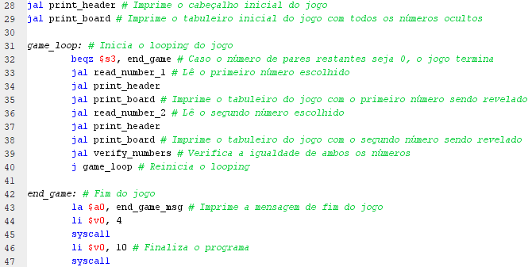

Na imagem, percebe-se que uma label indica o ínicio da execução em repetição. Abaixo dela, há uma comparação que verifica se a quantidade de pares restantes é igual a 0. Caso seja, pula para a branch "end_game", que representa o fim de jogo.

Em seguida, as funções encarregadas da lógica de funcionamento do programa são chamadas e, no fim do looping, a instrução "j game_loop" volta para o início da repetição.

As funções implementadas são:

<h4>print_header</h4>

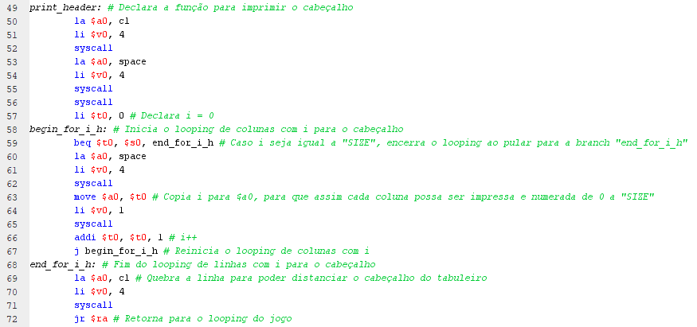

Ela é responsável por imprimir o cabeçalho do jogo, o qual, junto ao tabuleiro, formarão o layout principal. Sua lógica é simples: o registrador $t0 recebe o valor 0 na instrução "li $t0" e serve como o iterador "i", que vai servir para imprimir os índices de cada coluna no cabeçalho com um espaço entre elas.

Portanto, "i" começa como 0 e é impresso até ser igual a "SIZE", quando há o pulo para a branch "end_for_i_h" pela instrução "beq $t0, $s0, end_for_i_h" e o encerramento do looping e da função.

<h4>print_board</h4>

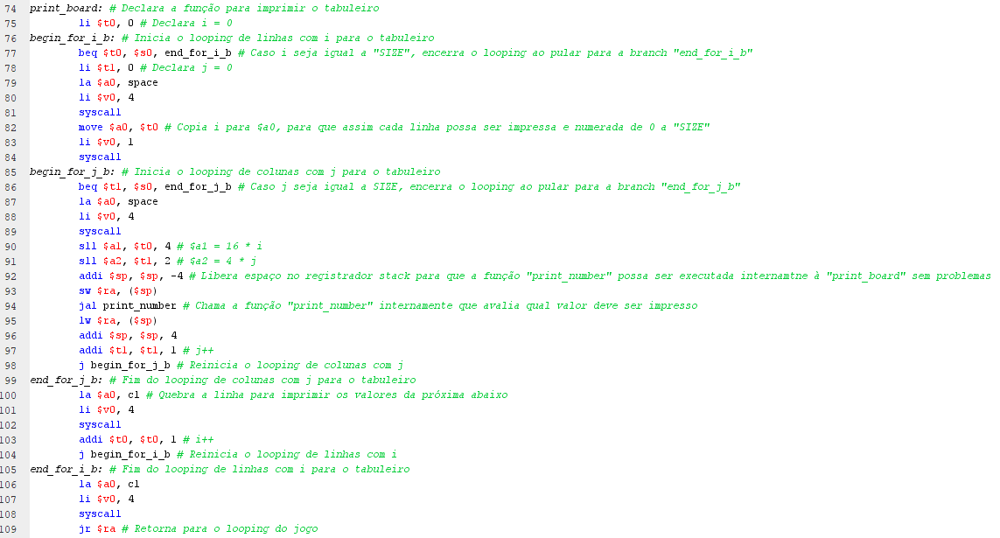

Funcionando como o complemento, da função "print_header", a função "print_board" tem a missão de imprimir o tabuleiro do jogo com seus elementos.

No seu começo, um "i" é declarado como 0 em $t0 e seu looping é iniciado pela branch "begin_for_i_b", tendo como condição a instrução "beq $t0, $s0, end_for_i_b" para que seja repetido até que "i" seja igual a "SIZE". O mesmo acontece com "j", que é iniciado como 0 dentro de $t1,controlado pela instrução "beq $t1, $s0, end_for_j_b" e reiniciado na label "begin_for_j_b".

Ambos loopings ocorrem pelas instruções "j begin_for_i_b" e "j begin_for_j_b", respectivamente, e são terminados pelas branchs "end_for_i_b" e "end_for_j_b".

Internamente aos dois, ocorre a lógica de cálculo do endereço do número a ser impresso pelas alocações de registradores "sll $a1, $t0, 4" e "sll $a2, $t1, 2". Isso é necessário pois os endereços, em MIPS, são trabalhados alinhados a palavras. Isto é, as instruções anteriores realizam, basicamente, a multiplicação de "i" por 16 e "j" por 4.

Logicamente, "i" será multiplicado por 16 já que representa a linha do elemento, portanto, é mais significante que "j", que é multiplicado por 4 para também se alinhar à métrica das palavras, que precisam ser sempre múltiplas de 4 pela estruturação da memória.

Depois, a função "print_number" é chamada no interior de "print_board" para decidir o que será impresso. OBS.: A chamada de "print_number" é feita pela liberação de memória no registrador stack $sp; essa técnica é uma forma de executar uma função dentro de outra sem que o endereço em $ra seja perdido.

<h4>print_number</h4>

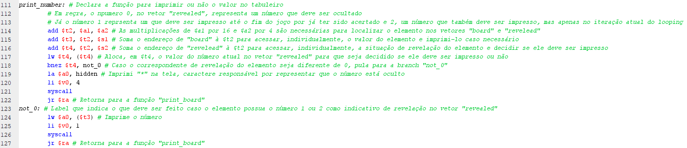

Em "print_number", $a1 e $a2 servem como seus parâmetros e ocorre o cálculo do endereço do número a ser impresso nos vetores "board" e "revealed".

As instruções que o fazem são "add $t2, $a1, $a2", que aloca, em $t2, a soma dos valores de "i" e "j" adaptados à forma de palavras; "add $t3, $t2, $a1", que copia para $t3 o endereço do elemento no vetor "board" pela soma do endereço inicial dele com o valor formado pela soma de $a1 e $a2; "add $t4, $t2, $a2", que faz o mesmo para o vetor "revealed"; "lw $t4, ($t4)", que transfere o correspondente do elemento no vetor "revealed" para $t4; e "lw $a0, ($t3)", que torna $a0 no valor real do elemento em questão, sendo usado, caso necessário, para a impressão do mesmo.

Para decidir se o número deve ser ocultado ou impresso, há a instrução "bnez $t4, not_0". Sua função é, caso o correspondente do vetor "revealed" for igual a 0, deixar com que as instruções a serem executadas sejam as que imprimam um "*" no console, o qual representa um número oculto, e retornar para "print_board". Caso for diferente, imprimir o próprio número ao pular para "not_0" e retornar a "print_board".

<h4>read_number_1</h4>

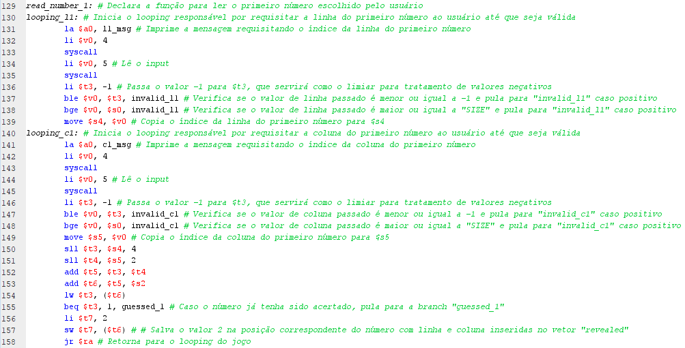

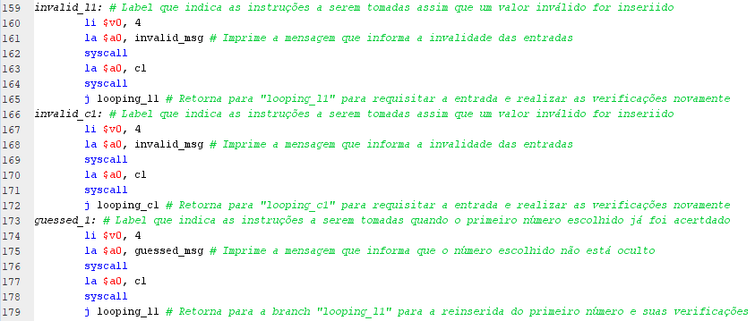

Para ler o primeiro número do usuário, são necessários serem lidos, primariamente, o índice da linha e coluna em que ele se encontra. Por isso, as mensagens de requerimento de input são imprimidas na tela e as entradas são lidas, sendo armazenadas, respectivamente, em $s4 e $s5.

Antes de serem armazenadas, porém, são validados para haver a certificação de que não há nenhum input indevido. Os casos de invalidade são os em que são negativos e maiores ou iguais ao valor de "SIZE".

Essas checagens ocorrem nas instruções "ble $v0, $t3, invalid_l1", "bge $v0, $s0, invalid_l1", "ble $v0, $t3, invalid_c1" e "bge $v0, $s0, invalid_c1", em que, caso as entradas sejam realmente inválidas, a branch é pulada para "invalid_l1" ou "invalid_c1", onde são tratadas.

Dentro dos "invalids", uma mensagem informando a invalidade é impressa no console e há o pulo de volta para o início do looping do respectivo input para que sejam reinseridos, podendo ser "looping_c1" ou "looping_c2".

Em caso de não houverem inputs inválidos, acontece a verificação para confirmar que a posição não foi acertada em jogadas anteriores, o que caracterizaria um número que não pode mais ser selecionado. Tal checagem é feita pela instrução "beq $t3, 1, guessed_1", que analisa se o correspondente do elemento em "revealed" é 1 (acertado); caso seja, pula para a label "guessed_1".

Em "guessed_1", uma mensagem é mostrada ao usuário dizendo que o número já foi acertado e o looping de entrada é novamente reiniciado com "j looping_l1".

Caso não haja nenhuma inconsistência nos inputs, o correspondente do vetor "revealed" do número é alterado para 2 (revelado temporariamente) e a instrução é retornada para o looping do jogo.

<h4>read_number_2</h4>

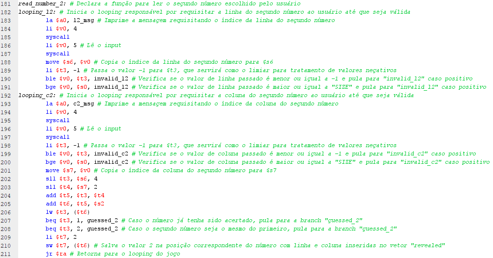

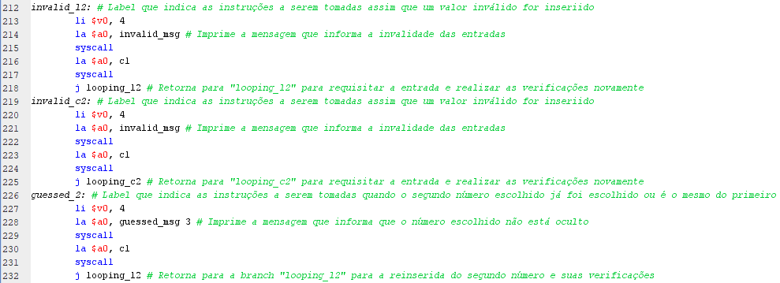

Ela funcionada identicamente à "read_number_2", com a diferença que existe uma verifação para garantir que o segundo número não está na mesma posição do primeiro. Esse trabalho é feito por "beq $t3, 2, guessed_2", que pula para "guesed_2" caso elas sejam iguais.

Além disso, não há nenhuma outra modificação e "read_number_2" se finaliza com o encerramento do looping das entradas e o retorno para o bloco inicial.

<h4>verify_numbers</h4>

A função "verify_numbers" é criada para constatar se os dois números escolhidos são iguais e, caso sejam, revela-los incessantemente.

Ela faz isso calculando os valores reais das duas posições por meio de técnicas já analisadas e alocando-os, respectivamente, em $t3 e $t7, assim como os endereços dos correspondentes de revelação do primeiro e segundo números, pondo-os em $t0 e $t1.

Posteriormente, ocorre a verificação "bne $t3, $t7, not_equal", que pula para a branch "not_equal" caso os valores sejam diferentes. Nela, seus corrsepondentes de "revealed" são mudados para 0 (oculto) e a instrução é retornada para o looping do jogo.

Caso sejam iguais, os mesmos correspondentes são alterados para 1 e a quantidade de pares restantes é diminuida em 1, com a finalização sendo o retorno para o looping principal.

<h3>Testes</h3>

Para que a aplicação seja certificadamente reconhecida como funcional, testes precisaram ser feitos em diversas situações. São eles, feitos com um tabuleiro de "SIZE" = 4:

<h4>Teste 1:</h4>

Entradas: [2, 1, 1, 0]

Reultado:

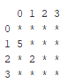

Entradas: [0, 3]

Resultado:

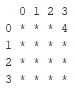

As posições (2, 1) e (1, 0) foram reveladas, e após as entradas [0, 3], devidamente ocultadas.

Como visualizado, não houveram erros durante a execução!

<h4>Teste 2:</h4>

Entradas: [3, 3, 1, 3]

Resultado:

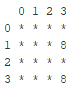

Entradas: [0, 0, 2, 0]

Resultado:

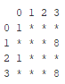

Entradas: [1, 3]

Resultado:

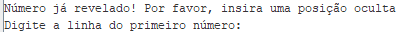

As posições (0, 0) e (2, 0) foram perfeitamente reveladas mesmo após a revelação das posições (3, 3) e (1, 3). Além disso, a revelação da posição (1, 3) foi prevenida de forma coerente por já estar revelada, o que retornou uma mensagem de invalidade e um pedido para a reinserção de entradas.

Como visualizado, não houveram erros durante a execução!

<h4>Teste 3</h4>

Entradas: [1, 1, 1, 1]

Resultado:

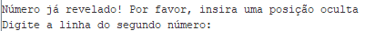

Entradas: [3, 1]

Resultado:

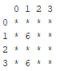

Entradas: [3, -2]

Resultado:

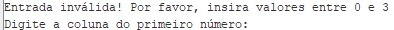

Entradas: [0, 1, 0]

Resultado:

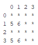

Entradas: [7]

Resultado: 

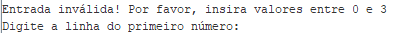

Entradas: [0, 3]

Resultado:

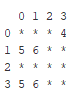

Após as entradas [1, 1, 1, 1], foi apontado, legitimamente, uma inconsistência em relação à repetição de posições, o que ocasionou uma necessidade de reinserção de entradas. Depois, o número de posição (3, 1) foi devidamente revelado e autenticado, sem problemas relacionados à verificação anterior.

Então, as entradas [3, -2] também foram bloqueadas por conta de -2 ser um número negativo, assim pedindo ao usuário mais uma digitação. Em seguida, as entradas [0, 1, 0] causaram um comportamento esperado e sucinto para o programa.

Mas, com a entrada [7], explicitou-se que o input era inválido e que o jogador deveria o inserir novamente, pois 7 é um número maior ou igual a "SIZE". De qualquer forma, as entradas [0, 3] formaram uma revelação de forma prudente para finalizar o teste.

Como visualizado, não houveram erros durante a execução!

<h2>Instruções MIPS</h2>

<h3>Como Usar o Circuito</h3>

O circuito pode ser testado usando um arquivo de texto, com os comandos MIPS escritos em hexadecimal, ou inserindos diretamente na memória que por sua vez passa para a ULA, que por sua vez segmenta o comando em partições em binário, que definem qual tipo e valor de instruções serão executadas.

<h3>Funcionamento das Instruções</h3>

<h4>Instrução And</h4>

Formato da instrução tem:

opcode(6 bits) + rd(5 bits) + rs(5 bits) + rt(5 bits) + shamt(5 bits) + funct(6 bits) 

Onde o funct, carrega o número 000100, e realiza uma verificação bit à bit do conteúdo dos registradores rt e rs. Essa instrução é aplicada dentro da ULA (Unidade Logica Aritimética), onde o valor final é defido pelo funct inserido no seletor do multiplexador, no caso o funct And, e por fim o valor é enviado para o túnel ULA_OUT, depois para o túnel DIN e por fim é armazenado no registrador indicado na partição rd no comando hexadecial.

<h4>Instrução OR</h4>

Formato da instrução:

opcode(6 bits) + rd(5 bits) + rs(5 bits) + rt(5 bits) + shamt(5 bits) + funct(6 bits)

Essa instrução possui quase o mesmo formato de execução da instrução anterior, tendo o mesmo funcionamento de verificação bit a bit, e a mesma inserção no registrador rd da verificação dos valores dos registradores rt e rs. Tendo como única diferença, a sua instrução da anterior, o funct, que carrega o número 000101.

<h4>Instrução BNE</h4>

Formato da instrução:

<b>opcode(6 bits) + rs(5 bits) + rt(5 bits) + immediate(16 bits)</b>

Essa instrução possui opcode de número 001001, e ela executa uma verificação do conteúdo dos registradores de rt e rs, onde caso seus conteúdo sejam diferentes, ocorre um salto para o valor contido na label. O valor de opcode entra na unidade de controle UC, retornando uma carga alta para o túnel BNE, em seguida os valores de rs e rt vão para a ULA, onde é verificado que são diferentes, mandando uma carga alta para o túnel DIFF. Em seguida as cargas dos túneis DIFF e BNE são colocadas em uma porta and, que insere a carga em um multiplexador, permitindo a passagem do valor do endereço contido no túnel BNE_ADDRS, carregando seu conteúdo no regitrador do PC.
O valor contido no endereço do túnel BNE_ADDRS é resultado valor da partição immediate, extendido de 16 para 32 bits, somado ao conteúdo do registrador de PC.

<h4>Instrução SLTI</h4>

Formato da instrução:

<b>opcode(6 bits) + rs(5 bits) + rt(5 bits) + immediate(16 bits)</b>

Essa instrução possui o opcode 001010 compara o conteúdo do registrador rs com um valor imediato. Se o conteúdo de rs for menor, o registrador rt recebe o valor 1, caso contrário, recebe 0. O opcode entra no UC, que por sua vez devolve cargar altas para os túneis ULAOP00, ULAOP01, ULAOP02, ULASRC e REGDEST, onde o 3 primeiros são unidos e organizados com um destribuidor e armazenados para o túnel ULAOP, que tem seu valor estendido de 3 para 6 bits, e o túnel ULASRC permite que o conteúdo de ULAOP seja carregado, atrávez de um multiplexador, na ULA. Esse valor é usado para escolher a saída da comparação rs menor que immediate , estendida para 32 bits, no multiplexador da ULA, saindo se a condição for verdadeira o número 1 em 32 bits. Logo após esse valor da saída da ULA é armazenado do túnel ULA_OUT e em seguida no túnel DIN, e por fim armazenado no registrador de rt, sendo permitido pela carga do túnel REGDEST no multiplexador da entrada DIN do banco de registradores.

<h4>Instrução SLT</h4>

Formato da instrução:

<b>opcode(6 bits) + rd(5 bits) + rs(5 bits) + rt(5 bits) + shamt(5 bits) + funct(6 bits)</b> 

Essa instrução possui o funct 000110, ela tem uma funcionalidade semelhante a instrução anterior, tendo a diferença que a comparação ocorre entre os valores dos registradores rs e rt, onde caso o conteúdo de rs seja menor que o de rt, o valor 1, estendido para 32 bits é armazenado em rd. A ULA usa o valor da partição funct para permitir a passagem do valor obtido pela verificação entre rs e rt, armazenando no túnel ULA_OUT e em seguida no túnel DIN. Como o túnel REGDEST não possui carga alta, o registrado que recebe o valor da verificação é o rd.

<h4>Instrução JR</h4>

Formato da instrução:

<b>opcode(6 bits) + rd(5 bits) + rs(5 bits) + immediate(16bits)</b>

Essa instrução possui o opcode 001011, ela executa um salto para a posição da memória correspondente ao endereço armazenado em rd. O opcode dessa instrução não é inserido na UC das instruções anteriores, mas sim em outra UC, que com esse opcode, coloca uma carga alta no túnel JR, que por sua vez permite a passagem do conteúdo do túnel JR_ADDRS, cujo conteúdo é o valor do túnel BR_RS, que possui o valor do registrador rs inserido no banco de registradores. Por fim ocorre a inserção do valor do túnel JR_ADDRS dentro do registrador do PC, mudando a instrução que será executada a seguir.

<h4>Instrução JAL</h4>

Formato da instrução:

<b>opcode(6 bits) + label(26 bits)</b>

Essa instrução possui o opcode 001100, e ela tem o intuito de realizar um salto para a label inserida, entretanto, seu diferencial é que ela armazena a próxima posição da memória no registrador 31, possibilitando um possível retorno para essa posição já armazenada. O opcode dessa instrução também entra na segunda UC, a mesma da instrução anterior, que devolve com esse valor uma carga alta para o túnel JAL, que por sua vez possibilita a passagem da constante "1f",valor 31, através do multiplexador de RD, que indica o registrador 31. O túnel JAL também possibilita a passagem do valor do túnel PC_4, que contém o valor do túnel PC somado com a constante 4, para ser armazenado no registrador rd, através do multiplexador da entrada DIN do banco de registradores. Com o valor de retorno já armazenado ocorre o salto, que é possibilitado pelo túnel JUMP, contendo ua carga alta vinda da primeira UC, que permite a passagem do conteúdo do túnel JUMP_ADDRS para o registrador do PC. O valor de JUMP_ADDRS é obtido pela label inserida pelo usuário.    

<h4>Instrução SLL</h4>

Formato da instrução:

<b>opcode(6 bits) + rd(5 bits) + rs(5 bits) + rt(5 bits) + shamt(5 bits) + funct(6 bits)</b>

Essa instrução possui o funct 000111, ela executa uma multiplicação do conteúdo de rs um multiplo de 2, arrastando"" os bits para a esquerda uma determinada quantidade de vezes, e armazenando essa multiplicação em rt. Acontece o envio do valor do registrador de rs para a ULA, onde é aplicado o valor da partição shamt, contido no túnel SHAMT após a destribuição, no valor de rs, usando um deslocador para a esquerda, que "arrasta" os bits de rs a quantidade de vezes presente no shamt, realizando uma "multiplicação" do valor. Por fim, o valor sai da ULA através do multiplexador da mesma, sendo inserido no túnel ULA_OUT, que coloca o valor no túnel DIN e armazena no registrador rt escolhido. 

<h4>Instrução SLR</h4>

Formato da instrução:

<b>opcode(6 bits) + rd(5 bits) + rs(5 bits) + rt(5 bits) + shamt(5 bits) + funct(6 bits)</b>

Essa instrução possui o funct 001000, ela possui quase a mesma execução que a instrução anterior, com o detalhe de que o valor de rs é "arrastado" para a direita, realizando uma divisão do valor por um número multiplo de 2. O valor do registrador rs é enviado para ULA, onde ele é "arrastado" com um deslocador para a direita, sendo "dividido" por 2 a quantidade de vezes especificada no shamt, e posteriormente sendo armazenado em no registrador rt usando os túneis já descritos na instrução passada.

<h3>Testes</h3>

<h4>Teste 1 (AND):</h4>

Código hexadecimal utilizado: 01095004

Comportamento esperado: Guardar, no registrador $10, o resultado de um AND entre os registradores $8 e $9

Resultado:

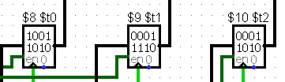

Como visualizado, não houveram erros durante a execução!

<h4>Teste 2 (OR):</h4>

Código hexadecimal utilizado: 015c5805

Comportamento esperado: Armazenar, em $13, o resultado de um OR entre os registradores $11 e $12

Resultado:

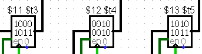

Como visualizado, não houveram erros durante a execução!

<h4>Teste 3 (BNE):</h4>

Código hexadecimal utilizado: 25cf0008

Comportamento esperado: Caso $14 for diferente de $15, pular para 000a

Resultado:

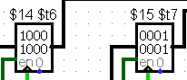

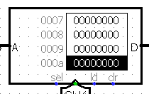

Como visualizado, não houveram erros durante a execução!

<h4>Teste 4 (SLTI):</h4>

Código hexadecimal utilizado: 2a110008

Comportamento esperado: Caso $16 for menor que 0020, transferir 1 para $17

Resultado:

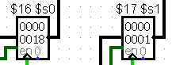

Como visualizado, não houveram erros durante a execução!

<h4>Teste 5 (SLT):</h4>

Código hexadecimal utilizado: 02329806

Comportamento esperado: Caso $18 for menor que $19, transferir 1 para $20

Resultado:

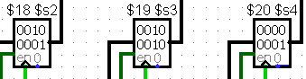

Como visualizado, não houveram erros durante a execução!

<h4>Teste 6 (JR):</h4>

Código hexadecimal utilizado: 2e800000

Comportamento esperado: O endereço de memória recebe o valor armazenado por $21

Resultado:

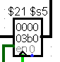

Como visualizado, não houveram erros durante a execução!

<h4>Teste 7 (JAL):</h4>

Código hexadecimal utilizado: 30000004

Comportamento esperado: 

Resultado:

Como visualizado, não houveram erros durante a execução!

<h4>Teste 8 (SLL):</h4>

Código hexadecimal utilizado: 02b6b887

Comportamento esperado: 

Resultado:

Como visualizado, não houveram erros durante a execução!

<h4>Teste 1 (SLR):</h4>

Código hexadecimal utilizado: 0319d048

Comportamento esperado: 

Resultado:

Como visualizado, não houveram erros durante a execução!
